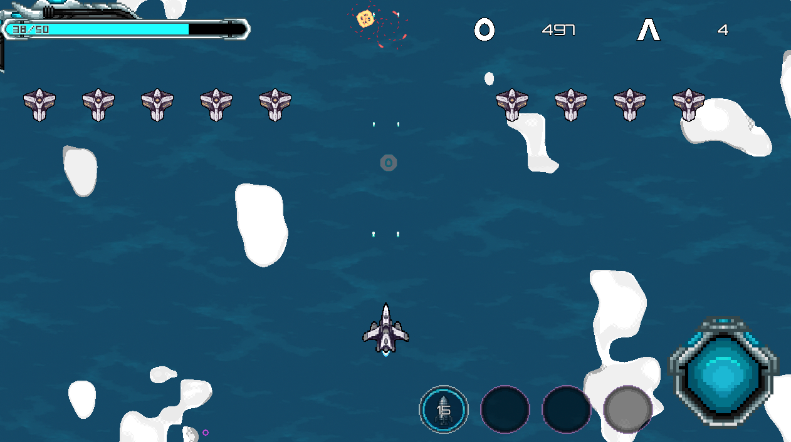
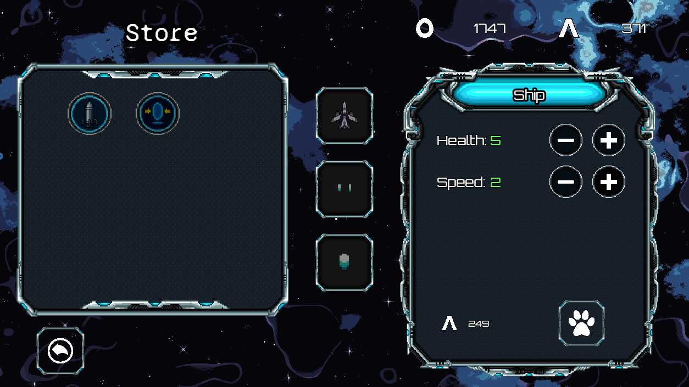
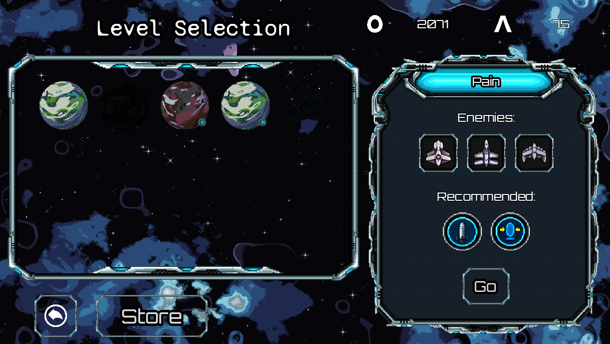
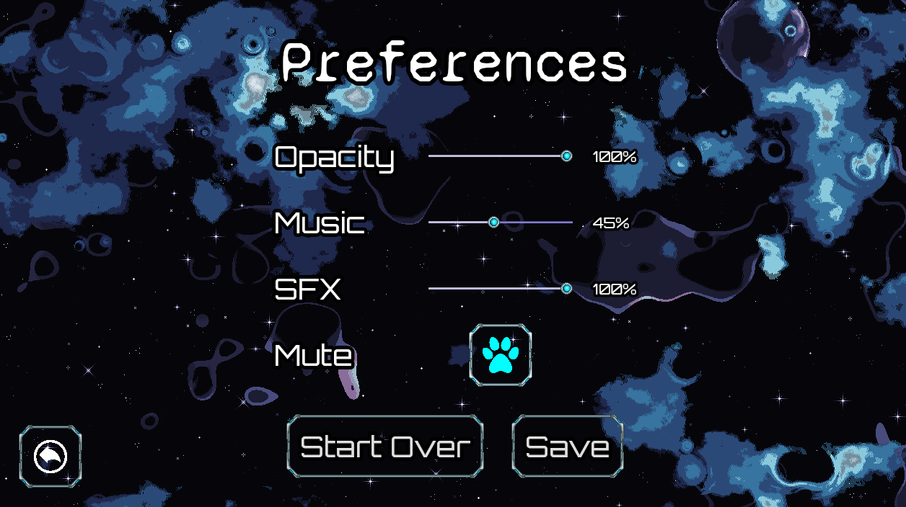
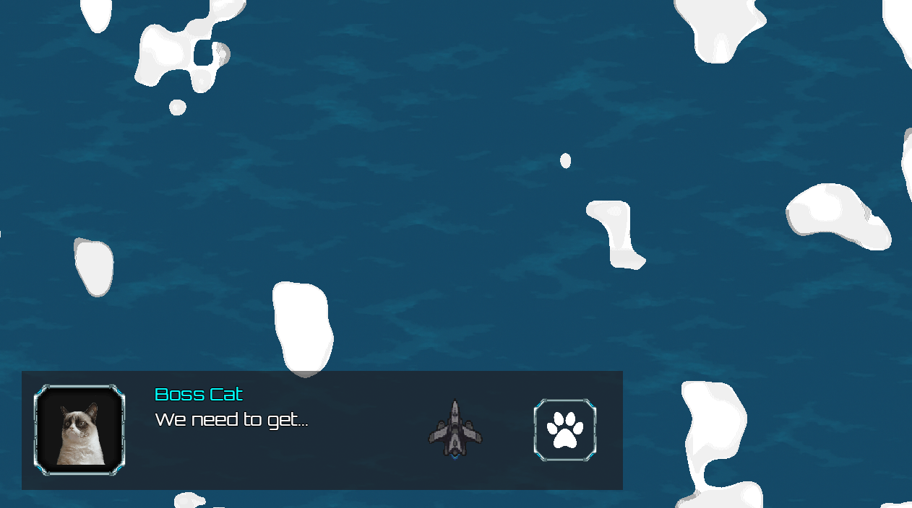

# [2D Space Shooter](https://github.com/joseag312/portfolio-2d-arcade-game)

👾 **2D space shooter game built with Godot Engine**

An absurd 2D shoot-em-up built with Godot 4 on C#.
Arcade-style space shooter with RPG elements where players:

- Battle waves of enemies.
- Collect power-ups to survive.
- Upgrade their ship with RPG elements.

**Designed as a portfolio piece to showcase software engineering best practices.**

---

## Portfolio Focus

This project was designed as a **demonstration of software engineering practices** applied to game development.

### SOLID

- **Single Responsibility Principle**: Components handle one responsibility (movement, health, drops).
- **Open/Closed Principle**: New weapons/enemies added without modifying existing code.
- **Liskov Substitution Principle**: Enemy/weapon variants swap seamlessly with base types.
- **Interface Segregation Principle**: Systems expose only needed methods via clear contracts.
- **Dependency Inversion Principle**: Gameplay depends on abstractions, not concrete classes.

### Design Patterns

- **Component-Based Design**: Enemies, drops, HUD and menus built following **Entity–Component** pattern.
- **Autoload Singletons**: Global state and services handled using **Singleton** patterns.
- **Signal/Event-Driven Flow**: Loose coupling between gameplay elements following the **Observer pattern**.
- **Catalogs & Data Resources**: **Repository** pattern and Data-Driven Design allows for extension in levels and powerups.
- **Weapon State System**: Runtime weapon state wraps base data using the **Decorator pattern**.
- **Spawner System**: Enemy spawners function as a **Factory pattern**, instantiating enemies and bosses at runtime.
- **Input & AI Movement**: **Strategy pattern** for enemy movement vs player movement.
- **Level Flow Management**: Levels shift cleanly between states, inspired by the **State pattern**.

### Data Persistence

- **Save/Load Systems**: Weapon inventory, progression, and settings are serialized.
- **Schema Versioning**: Save data includes schema version checks.
- **Catalog-Driven Data**: Weapons and levels defined as resources for **data-driven design**.

### Systems Engineering

- **Weapon System**: Runtime model manages cooldowns, upgrades, and overrides.
- **Economy & Store**: Balanced currency system integrated into persistence.
- **Drop System**: Loot drops (currency, health) are reusable prefabs.
- **Dialog System**: Modular HUD dialog box supporting messages, fading popups, and choice prompts.

---

## 🎮 **Features**

- **5 Playable Levels**  
  Stages feature unique enemy waves and challenges.

- **Weapon System**  
  Modular weapons with upgrades, cooldown management, and visual HUD integration.

- **Economy & Store**  
  Earn in-game currency, spend in the store, and upgrade loadouts.

- **HUD & UI Systems**

  - Dialog system (choices, fading messages, prompts)
  - Power HUD with cooldown animations
  - Currency and life tracking
  - Game flow screens (game over, level complete, menu, settings)

- **Polished UX**

  - Fade-in menus
  - Settings with volume/mute, HUD opacity
  - Mobile-friendly input (touch/joystick ready for adaptation)

- **Extensible Architecture**
  - Movement, hitboxes/hurtboxes, enemy drops, spawners
  - LevelFlowComponent system for reusability
  - Centralized autoloads (settings, music, SFX, game stats)

---

## Tech Stack

- **Engine**: Godot 4 (C#)
- **Language**: C# with Godot API
- **Tools**: Git, React (portfolio site)

---

## Get Started

- Download [Godot Engine 4](https://godotengine.org)
- Clone the GitHub Repo
- Open the `project.godot` file with Godot

---

## Screenshots

### 🎮 Gameplay

### 🛒 Store

### 🪐 Levels

### ⚙️ Settings

### 💬 Dialog

---
